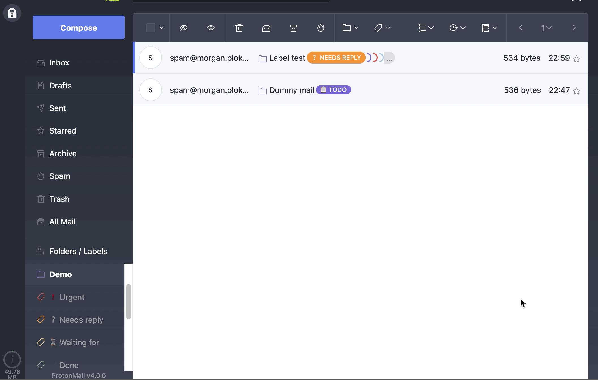

# ProtonMail custom CSS

This is my custom CSS for ProtonMail V4.0.0 (beta).

## Features

- Get rid of the drawer effect on the labels to make them visible without the need of the mouse
- Sort labels according to a defined order. Default is first applied labels appear to the most left
- Breath effect for important labels

### Default



### Custom


## Requirements

- Less.js v3.10.3
- npm

### Installation

Run the following command to install Less.js:

```shell
$ npm install -g less
```

## Compilation

Run the following command to compile the Less file:

```shell
$ lessc pm-custom.less pm-custom.css
```

Or hit <kbd>Ctrl</kbd> + <kbd>Shift</kbd> + <kbd>B</kbd> in VS Code (or <kbd>Cmd</kbd> + <kbd>Shift</kbd> + <kbd>B</kbd> on macOS).


## Installation

Copy the content of `pm-custom.css` into the [Custom Theme dialog](https://beta.protonmail.com/settings/appearance) in ProtonMail settings.
